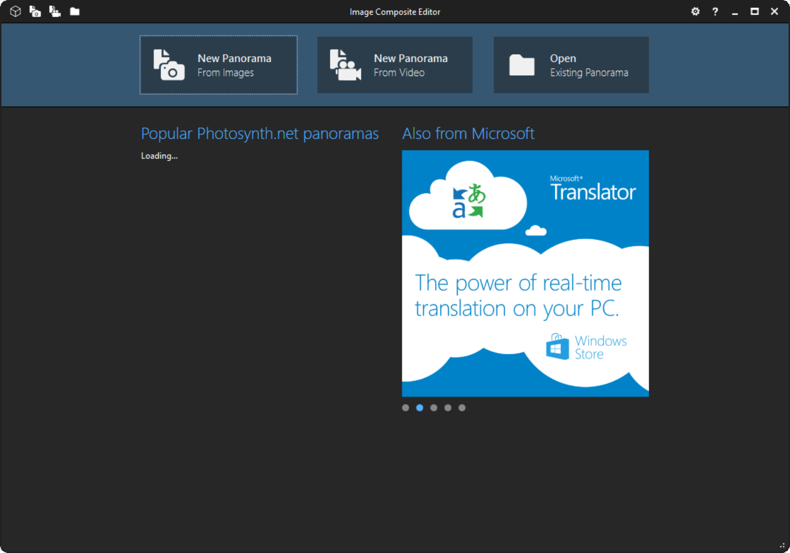
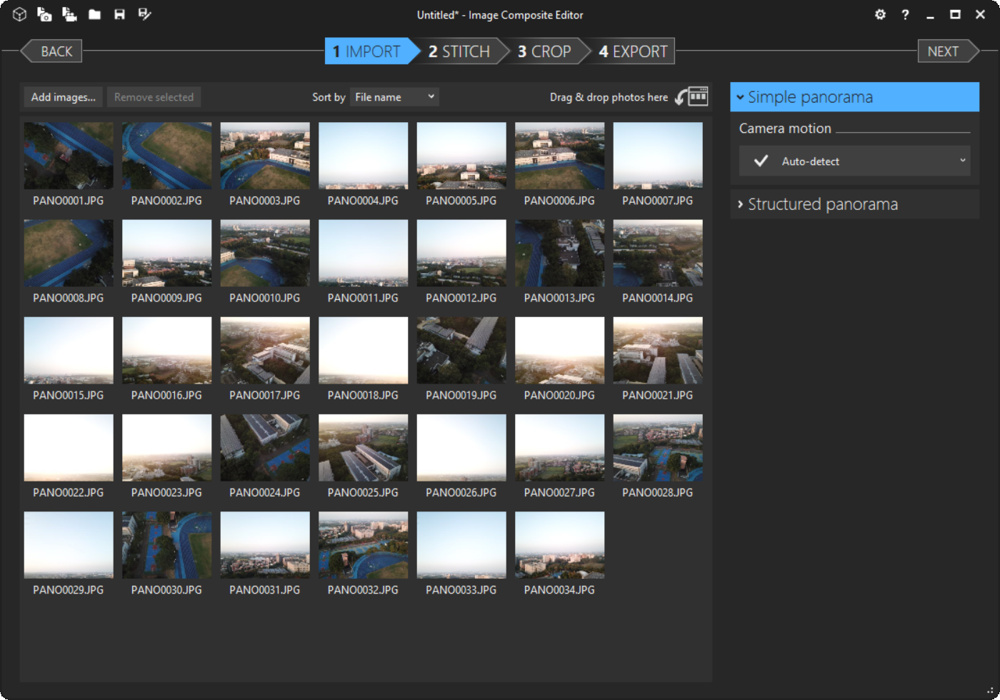
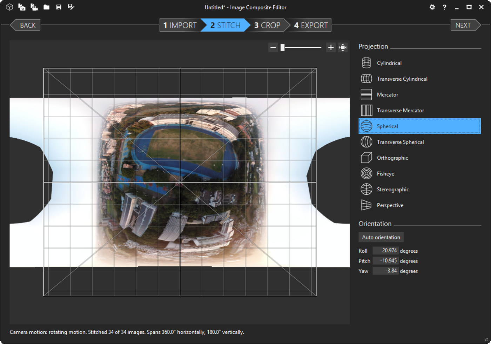
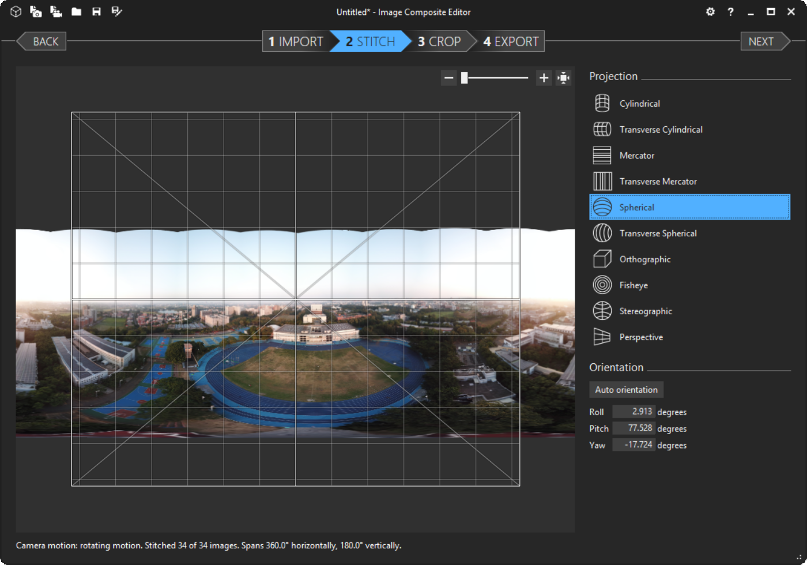
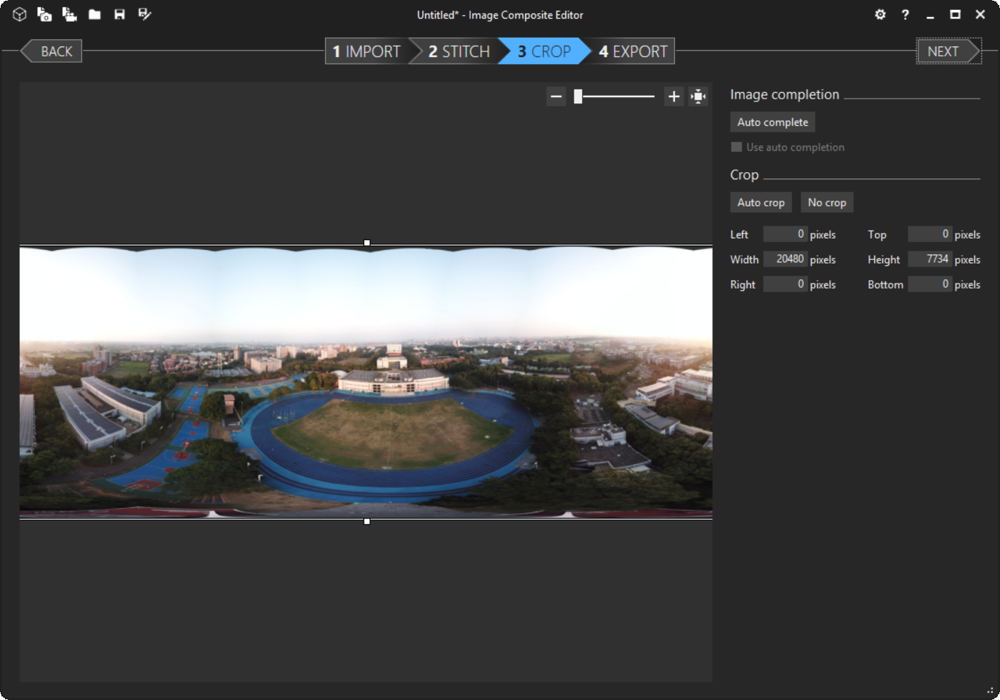
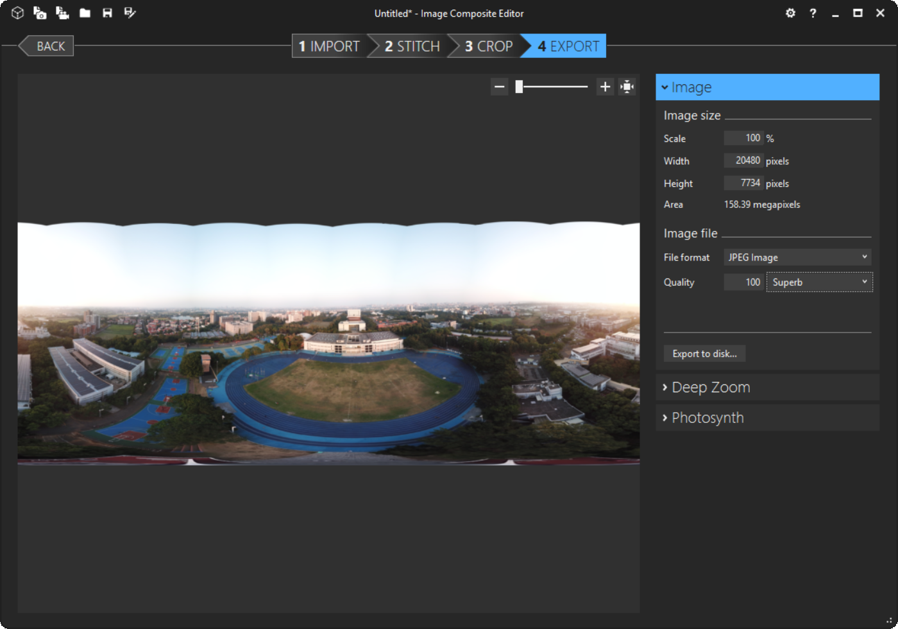

# cy_panorama
A simple panorama tool

Features:
1. Convert a panorama image(spherical projection) to a Facebook supported format

## TODO
1. Support stitch feature

## Install
`pip install cy_panorama`

## Usage
`panorama_convert_fb input.jpg -o output.jpg`

## Note
Requirements of Facebook's Panaroma image:
* Image width less than 6000 pixels
* Image ratio(width:height) is 2:1
* EXIF contains:
   * make: RICOH
   * model: RICOH THETA S

## HOW to generate a panorama image
1. Install and open [Microsoft Image Composite Editor](https://www.microsoft.com/en-us/research/product/computational-photography-applications/image-composite-editor/)
1. Press **New Panorama** to load images

1. Press **NEXT**

1. Projection select **Spherical**

1. Drag image, let the sky on the top of image, then press **NEXT**

1. Press **NEXT** again

1. Adjust image size/quality... then press **Export to disk...** to save image

1. Finally, use panorama_convert_fb to convert the image to Facebook acceptable format.
`panorama_convert_fb input.jpg -o output.jpg`
